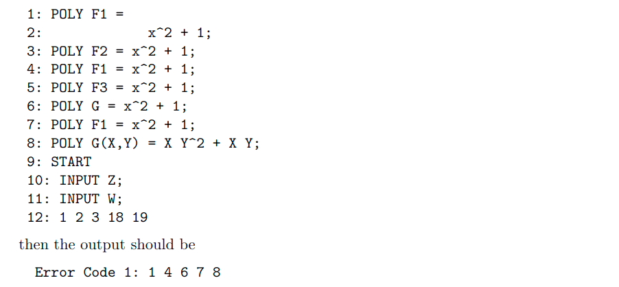

# Simple-Compiler
A Simple Compiler that  will read the program and make sure that its syntax and semantics are correct. If the syntaxor semantics are not correct, the compiler will output an error message with the line number. If input programhas correct syntax and semantics, the compiler should evaluate the polynomial expressions in the START section of the program and the output of the compiler is the sequence of values resulting from the evaluationsof the polynomials in the START section.

Demonstration of the program with input and output:

